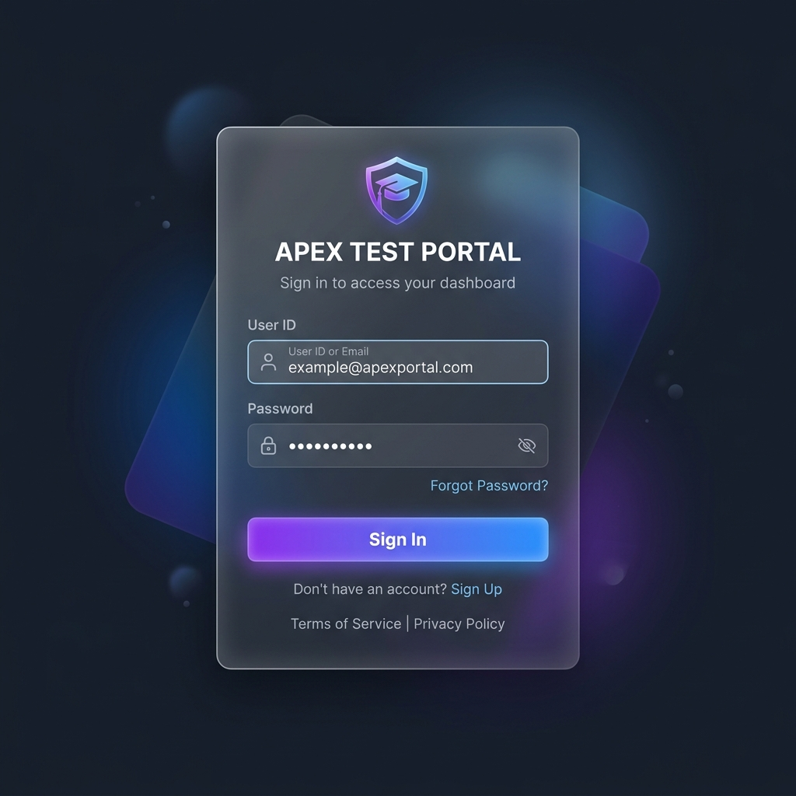
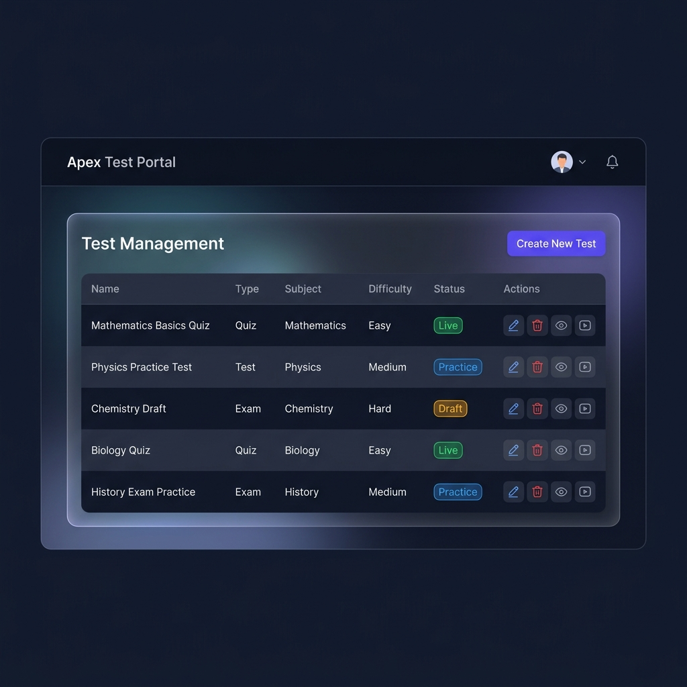
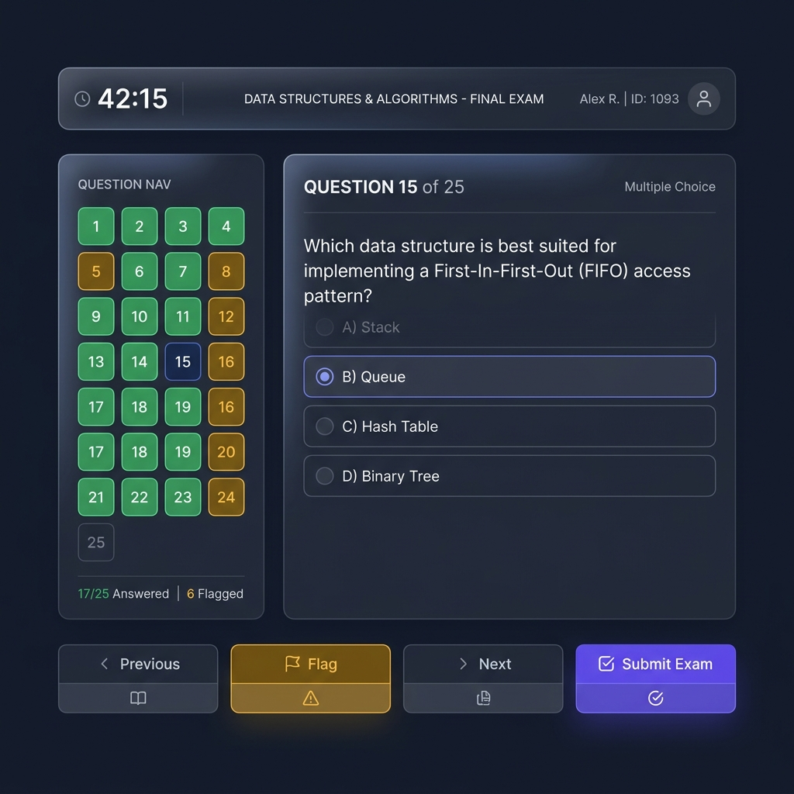

<div align="center">

<br/>

# 🎓 Apex Test Portal

### A Modern Test Management & Examination Platform

<br/>

[](https://react.dev/)
[](https://vitejs.dev/)
[](https://reactrouter.com/)
[](LICENSE)

<br/>

**Apex Test Portal** is a sleek, dark-themed admin dashboard that lets educators create tests, manage question banks, preview exams, and simulate a real student test-taking experience — all from one place. No backend required.

<br/>

[🚀 Getting Started](#-getting-started) · [✨ Features](#-features) · [📖 Pages](#-page-by-page-breakdown) · [🎨 Design](#-design-philosophy) · [🤝 Contributing](#-contributing)

<br/>

---

### 🔐 Login &nbsp;&nbsp;·&nbsp;&nbsp; 📊 Dashboard &nbsp;&nbsp;·&nbsp;&nbsp; 🎯 Exam Interface





</div>

---

## ✨ Features

| Feature | Description |
|---|---|
| 🔐 **Secure Login** | Multi-user authentication with role-based profiles |
| 📊 **Dashboard** | Manage all tests in one place — create, edit, delete, go live |
| 📝 **Test Builder** | Configure subjects, topics, marking schemes, difficulty & time limits |
| ❓ **Question Bank** | Bulk-add single/multiple-choice questions with explanations |
| 👁️ **Live Preview** | See exactly how a test looks before publishing |
| 🎯 **Demo Exam Mode** | Take the test as a student would — timer, navigation, and scoring |

---

## 🛠️ Tech Stack

| Layer | Technology |
|---|---|
| **Frontend** | React 19 + JSX |
| **Build Tool** | Vite 8 (lightning-fast HMR) |
| **Routing** | React Router DOM v7 |
| **Forms** | React Hook Form v7 |
| **HTTP Client** | Axios (with custom mock adapter) |
| **Styling** | Vanilla CSS (custom design system) |
| **State** | `localStorage` (mock database) |

> **Note:** This project is fully client-side — no backend server required. All data persists in `localStorage`, making it perfect for demos and prototyping.

---

## 🚀 Getting Started

### Prerequisites

- **Node.js** v18 or later
- **npm** v9 or later

### Installation

```bash
# 1. Clone the repo
git clone https://github.com/your-username/apex-test-portal.git
cd apex-test-portal

# 2. Install dependencies
npm install

# 3. Start the dev server
npm run dev
```

The app will be live at **http://localhost:5173** 🎉

### Build for Production

```bash
npm run build
npm run preview
```

---

## 🔑 Demo Credentials

| User ID | Password | Profile |
|---|---|---|
| `vaibhav` | `123456789` | Vaibhav Bhosle |
| `ajinkya` | `123456789` | Ajinkya |

---

## 📁 Project Structure

```
apex-test-portal/
├── public/                      # Static assets
├── docs/
│   └── screenshots/             # README images
├── src/
│   ├── api.js                   # Mock API adapter & localStorage database
│   ├── main.jsx                 # App entry point
│   ├── App.jsx                  # Router configuration & route definitions
│   ├── index.css                # Global design system (dark theme, animations)
│   ├── App.css                  # App-level overrides
│   ├── components/
│   │   ├── Navbar.jsx           # Top navigation bar with user avatar & logout
│   │   └── ProtectedRoute.jsx   # Auth guard — redirects unauthenticated users
│   └── pages/
│       ├── LoginPage.jsx        # Authentication screen
│       ├── DashboardPage.jsx    # Test management table + CRUD actions
│       ├── CreateTestPage.jsx   # Multi-step test configuration form
│       ├── AddQuestionsPage.jsx # Bulk question entry with explanations
│       ├── PreviewPage.jsx      # Read-only test preview for admins
│       └── TakeExamPage.jsx     # Full CBT simulation with scoring
├── package.json
├── vite.config.js
└── README.md
```

---

## 📖 Page-by-Page Breakdown

### 1. 🔐 Login Page &nbsp;`/login`
- Glassmorphism card with animated gradient border
- User ID + password authentication against mock user store
- Auto-redirect to dashboard on successful login
- Error toast for invalid credentials

### 2. 📊 Dashboard &nbsp;`/dashboard`
- Sortable test management table with all created tests
- Status badges: **Live** (green) · **Practice** (blue) · **Draft** (amber)
- Per-row quick actions: ✏️ Edit · 🗑️ Delete · 👁️ Preview · 🎯 Demo
- **Create New Test** button to launch the test builder flow

### 3. 📝 Create Test &nbsp;`/tests/create`
- Subject → Topic → Sub-topic cascading dropdowns
- Configure: test type, difficulty, marking scheme, and time limit
- Full form validation via React Hook Form
- Redirects to question entry after creation

### 4. ❓ Add Questions &nbsp;`/tests/:id/questions`
- Dynamic form — add unlimited questions per test
- Supports **single-choice** and **multiple-choice** question types
- Mark correct answers and write detailed explanations per question
- Bulk save directly to the question bank

### 5. 👁️ Preview &nbsp;`/tests/:id/preview`
- Read-only view of the complete test with all questions
- Correct answers highlighted for admin review
- Displays full marking scheme and test metadata

### 6. 🎯 Demo Exam &nbsp;`/take-exam/:id`
- Full student-facing **Computer Based Test (CBT)** interface
- ⏱️ Live countdown timer
- 📋 Question navigation sidebar with colour-coded attempt status
- 🚩 Flag questions for later review
- 📊 Instant score report with right/wrong breakdown after submission

---

## 🎨 Design Philosophy

- **Dark Theme** — Easy on the eyes; modern and professional aesthetic
- **Glassmorphism** — Frosted-glass card effects with `backdrop-filter` blur
- **Micro-animations** — Smooth hover transitions, loading spinners, and fade-ins
- **Responsive Layout** — Optimised for desktop and tablet screens
- **Clean Typography** — Consistent font hierarchy with deliberate spacing

---

## 🤝 Contributing

Contributions, issues, and feature requests are welcome!

```bash
# 1. Fork and clone the repo
git checkout -b feature/your-feature-name

# 2. Make your changes
git commit -m "feat: add your feature description"

# 3. Push and open a pull request
git push origin feature/your-feature-name
```

Please follow the existing code style and keep commits descriptive.

---

## 📄 License

This project is licensed under the [MIT License](LICENSE).

---

<div align="center">

<br/>

<<<<<<< HEAD
Built with by **[Vaibhav Bhosle](https://github.com/your-username)**
=======
Built with ❤️ by **[Vaibhav Bhosle](https://github.com/your-username)**
>>>>>>> dd205fd6fcde81e436a74efe44879aa254b2b49d

<br/>

⭐ **Star this repo if you found it helpful!**

<<<<<<< HEAD
</div>
=======
</div>
>>>>>>> dd205fd6fcde81e436a74efe44879aa254b2b49d
